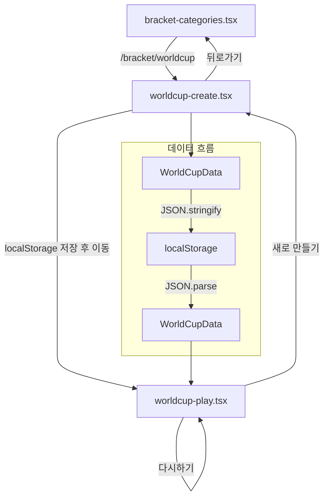

# Design Document: 취향 월드컵 (Preference World Cup)

## Overview

취향 월드컵은 사용자가 직접 토너먼트 형식의 월드컵을 만들고 플레이할 수 있는 클라이언트 전용 기능이다. React 18 + TypeScript 기반으로 구현되며, 기존 프로젝트의 shadcn/ui 컴포넌트와 Tailwind CSS 스타일링 패턴을 따른다.

기능은 두 개의 주요 페이지로 구성된다:
1. **생성 페이지** (`/bracket/worldcup`): 월드컵 제목 입력, 항목 추가/수정/삭제, 이미지 첨부, 라운드 선택
2. **플레이 페이지** (`/bracket/worldcup/play`): 토너먼트 진행, 결과 및 순위 표시

모든 데이터는 localStorage에 저장되어 서버 API 없이 동작하며, 이미지는 base64로 인코딩하여 저장한다.

## Architecture

### 전체 구조



### 기술 스택

- **UI 프레임워크**: React 18 (기존 프로젝트)
- **라우팅**: wouter (`/bracket/worldcup`, `/bracket/worldcup/play`)
- **UI 컴포넌트**: shadcn/ui (Button, Input)
- **스타일링**: Tailwind CSS
- **아이콘**: lucide-react
- **데이터 저장**: localStorage (JSON)
- **이미지 처리**: FileReader API (base64 인코딩)

### 설계 원칙

1. **클라이언트 전용**: 서버 API 호출 없이 모든 로직이 브라우저에서 실행
2. **기존 패턴 준수**: 프로젝트의 컴포넌트 구조, 스타일링, 라우팅 패턴을 따름
3. **모바일 반응형**: Tailwind의 반응형 유틸리티를 활용한 모바일 우선 설계
4. **단순한 상태 관리**: React useState로 로컬 상태 관리 (전역 상태 불필요)

## Components and Interfaces

### 페이지 컴포넌트

#### WorldCupCreatePage (`worldcup-create.tsx`)

생성 페이지의 주요 책임:
- 월드컵 제목 입력 관리
- 항목 목록 CRUD (추가, 수정, 삭제)
- 이미지 붙여넣기/파일 선택 처리
- 라운드 선택 및 게임 시작 (localStorage 저장 + 네비게이션)

```typescript
// 주요 상태
const [title, setTitle] = useState<string>("");
const [items, setItems] = useState<WorldCupItem[]>([]);
const [newItemName, setNewItemName] = useState<string>("");
```

#### WorldCupPlayPage (`worldcup-play.tsx`)

플레이 페이지의 주요 책임:
- localStorage에서 데이터 로드 및 초기화
- 토너먼트 매치 진행 (라운드별 페어링)
- 선택 애니메이션 처리
- 결과 화면 및 순위 계산

```typescript
// 주요 상태
const [worldCupData, setWorldCupData] = useState<WorldCupData | null>(null);
const [currentRound, setCurrentRound] = useState<WorldCupItem[]>([]);
const [nextRound, setNextRound] = useState<WorldCupItem[]>([]);
const [currentPair, setCurrentPair] = useState<[WorldCupItem, WorldCupItem] | null>(null);
const [isFinished, setIsFinished] = useState<boolean>(false);
const [winner, setWinner] = useState<WorldCupItem | null>(null);
const [rankings, setRankings] = useState<RankEntry[]>([]);
```

### 핵심 함수 (순수 로직)

```typescript
// 라운드 이름 반환
function getRoundName(count: number): string;

// 항목 추가 (중복 검사 포함)
function addItem(items: WorldCupItem[], name: string): WorldCupItem[] | null;

// 유효한 항목 필터링
function getValidItems(items: WorldCupItem[]): WorldCupItem[];

// 라운드 초기화 (셔플 + 선택)
function initializeRound(items: WorldCupItem[], roundSize: number): WorldCupItem[];

// 매치 선택 처리
function handleSelection(
  currentRound: WorldCupItem[],
  nextRound: WorldCupItem[],
  selected: WorldCupItem,
  loser: WorldCupItem,
  matchIndex: number
): TournamentState;

// 순위 계산
function calculateRankings(entries: RankEntry[]): RankEntry[];

// 월드컵 데이터 직렬화/역직렬화
function serializeWorldCupData(data: WorldCupData): string;
function deserializeWorldCupData(json: string): WorldCupData | null;
```

### 이미지 처리

```typescript
// 클립보드 붙여넣기 핸들러
function handlePaste(e: ClipboardEvent, itemId?: number): void;

// 파일 선택 핸들러 (유효성 검사 포함)
function handleFileSelect(file: File, itemId: number): void;

// 유효성 검사
function validateImageFile(file: File): { valid: boolean; error?: string };
```

## Data Models

### WorldCupItem

```typescript
interface WorldCupItem {
  id: number;        // 고유 식별자 (Date.now() + Math.random())
  name: string;      // 항목 이름
  imageUrl: string;  // base64 인코딩된 이미지 또는 빈 문자열
}
```

### WorldCupData

```typescript
interface WorldCupData {
  title: string;          // 월드컵 제목 (최대 50자)
  items: WorldCupItem[];  // 유효한 항목 목록 (이름이 비어있지 않은 항목만)
  round: number;          // 선택된 라운드 (8, 16, 32, 64)
  createdAt: string;      // ISO 8601 형식 생성일시
}
```

### RankEntry

```typescript
interface RankEntry {
  item: WorldCupItem;       // 참가 항목
  rank: number;             // 최종 순위 (1부터 시작)
  eliminatedRound: string;  // 탈락 라운드 ("우승", "결승", "4강", "8강" 등)
  wins: number;             // 총 승수
}
```

### TournamentState

```typescript
interface TournamentState {
  currentRound: WorldCupItem[];
  nextRound: WorldCupItem[];
  currentPair: [WorldCupItem, WorldCupItem] | null;
  matchIndex: number;
  currentMatchInRound: number;
  roundName: string;
  isFinished: boolean;
  winner: WorldCupItem | null;
  rankings: RankEntry[];
}
```

### localStorage 스키마

| 키 | 값 | 설명 |
|---|---|---|
| `worldcup_current` | `JSON.stringify(WorldCupData)` | 현재 진행 중인 월드컵 데이터 |

## Correctness Properties

*A property is a characteristic or behavior that should hold true across all valid executions of a system—essentially, a formal statement about what the system should do. Properties serve as the bridge between human-readable specifications and machine-verifiable correctness guarantees.*

### Property 1: Adding a valid item grows the list

*For any* list of WorldCupItems and any valid (non-empty, non-duplicate) item name, adding it to the list should result in the list length increasing by exactly one and the new item appearing in the list.

**Validates: Requirements 1.2**

### Property 2: Duplicate items are rejected

*For any* list of WorldCupItems and any item name that already exists in the list, attempting to add it should return null (rejection) and the original list should remain unchanged.

**Validates: Requirements 1.3**

### Property 3: Removing an item shrinks the list

*For any* non-empty list of WorldCupItems and any item ID present in the list, removing that item should result in the list length decreasing by exactly one and the item no longer being present.

**Validates: Requirements 1.5**

### Property 4: Valid item count equals non-empty named items

*For any* list of WorldCupItems (with arbitrary mix of empty and non-empty names), the count of valid items should equal the number of items whose trimmed name is non-empty.

**Validates: Requirements 1.6**

### Property 5: Round button availability matches item count

*For any* number of valid items N and any round size R in {8, 16, 32, 64}, the round button for R should be enabled if and only if N >= R.

**Validates: Requirements 4.2**

### Property 6: Data serialization round trip

*For any* valid WorldCupData (non-empty title, items with non-empty names, valid round), serializing to JSON and deserializing should produce an equivalent object containing all required fields (title, items, round, createdAt), and the items array should contain only items with non-empty trimmed names.

**Validates: Requirements 4.3, 7.1, 7.2, 7.3**

### Property 7: Tournament initialization produces valid permutation

*For any* list of WorldCupItems with length >= roundSize, initializing a round should produce a list of exactly roundSize items where every item is a member of the original list and no item appears more than once.

**Validates: Requirements 5.1**

### Property 8: getRoundName mapping correctness

*For any* power-of-2 value in {2, 4, 8, 16, 32, 64}, getRoundName should return the corresponding Korean tournament round name ("결승", "4강", "8강", "16강", "32강", "64강").

**Validates: Requirements 5.2**

### Property 9: Tournament round progression preserves winners

*For any* round of N items (N is even, N >= 2), after N/2 selections are made, the next round should contain exactly N/2 items, all of which were selected as winners from their respective matches.

**Validates: Requirements 5.5, 5.6**

### Property 10: Ranking calculation completeness and ordering

*For any* complete tournament with N participants, the final ranking should contain exactly N entries, and for any two entries A and B where A.rank < B.rank, either A was eliminated in a later round than B, or they were eliminated in the same round and A has more wins than B.

**Validates: Requirements 6.1, 6.2**

## Error Handling

### 생성 페이지 에러 처리

| 상황 | 처리 방식 |
|---|---|
| 빈 항목 이름 추가 시도 | `alert("항목 이름을 입력해주세요.")` |
| 중복 항목 이름 추가 시도 | `alert("이미 등록된 항목입니다.")` |
| 빈 제목으로 시작 시도 | `alert("월드컵 제목을 입력해주세요.")` |
| 항목 부족으로 시작 시도 | `alert("N강을 진행하려면 최소 N개의 항목이 필요합니다. (현재 M개)")` |
| 이미지가 아닌 파일 선택 | `alert("이미지 파일만 업로드 가능합니다.")` |
| 5MB 초과 파일 선택 | `alert("5MB 이하의 이미지만 업로드 가능합니다.")` |

### 플레이 페이지 에러 처리

| 상황 | 처리 방식 |
|---|---|
| localStorage에 데이터 없음 | `alert` 후 `/bracket/worldcup`으로 리다이렉트 |
| JSON 파싱 실패 | `alert` 후 `/bracket/worldcup`으로 리다이렉트 |

### 이미지 처리 에러

- FileReader 에러 시 조용히 실패 (이미지 없이 항목 유지)
- 클립보드에 이미지가 아닌 데이터가 있으면 기본 텍스트 붙여넣기 동작 수행

## Testing Strategy

### 테스트 프레임워크

- **단위 테스트**: Vitest (Vite 프로젝트에 최적화)
- **속성 기반 테스트**: fast-check (TypeScript/JavaScript PBT 라이브러리)
- **컴포넌트 테스트**: React Testing Library (필요 시)

### 속성 기반 테스트 (Property-Based Tests)

각 Correctness Property에 대해 fast-check를 사용한 속성 기반 테스트를 작성한다.

**설정:**
- 최소 100회 반복 실행
- 각 테스트에 설계 문서의 Property 번호를 태그로 포함
- 태그 형식: `Feature: preference-worldcup, Property {number}: {property_text}`

**테스트 대상 순수 함수:**
- `addItem` — Property 1, 2
- `removeItem` — Property 3
- `getValidItems` / valid count 계산 — Property 4
- `getRoundOptions` (버튼 활성화 로직) — Property 5
- `serializeWorldCupData` / `deserializeWorldCupData` — Property 6
- `initializeRound` (셔플 + 선택) — Property 7
- `getRoundName` — Property 8
- Tournament progression 로직 — Property 9
- `calculateRankings` — Property 10

### 단위 테스트 (Example-Based)

- 이미지 파일 유효성 검사 (타입 체크, 크기 체크)
- UI 렌더링 확인 (버튼 존재, 입력 필드 존재)
- 네비게이션 동작 (뒤로가기, 새로 만들기)
- 결과 화면 메달 아이콘 표시

### 통합 테스트

- 클립보드 붙여넣기 이벤트 시뮬레이션
- 파일 선택 이벤트 시뮬레이션
- localStorage 읽기/쓰기 통합 동작

### 스모크 테스트

- `/bracket/worldcup` 경로 접근 시 생성 페이지 렌더링
- `/bracket/worldcup/play` 경로 접근 시 플레이 페이지 렌더링
